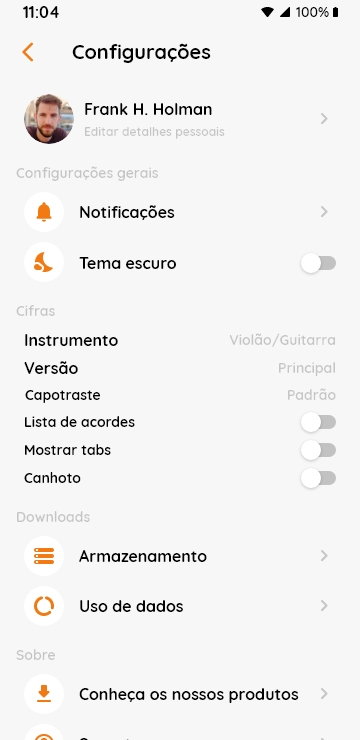
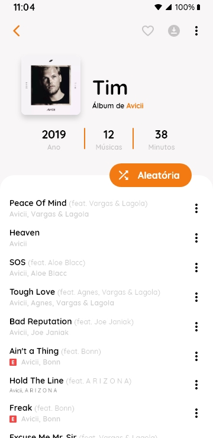

<p align="center">
  
       
  

</p>

# Cifra Club App - Flutter Redesign UI 

Esse projeto foi desevolvido como processo de redesing, partindo do projeto legado, e trazendo uma nova interface muito mais intitiva e minimalista além de funcionar com tema escuro diretamente do Smartphone

O Cifra Club Redesign se trata de um app mobile feito em Flutter para leitura de Cifras e tablaturas, contendo recursos como o uso de Firebase Core e SignIn, Animações e Estilizações Personalizadas, entre vários outros pontos, como o uso do SharedPreferences.

## Recursos:

=> Splash Page

=> Explore Page

=> Libary Page

=> Profile Page

=> Settings Page

=> Singer Page

=> Album Page

## Bibliotecas e Extensões usadas

- [flutter_svg](https://pub.dev/packages/flutter_svg)
- [google_fonts](https://pub.dev/packages/google_fonts)
- [firebase_core](https://pub.dev/packages/firebase_core)
- [google_sign_in](https://pub.dev/packages/google_sign_in)
- [google_sign_in_web](https://pub.dev/packages/google_sign_in_web)
- [shared_preferences](https://pub.dev/packages/shared_preferences)
- [carousel_slider](https://pub.dev/packages/carousel_slider)
- [expandable](https://pub.dev/packages/expandable)

## Estrutura da Pasta

Aqui está a estrutura de pasta principal que o flutter fornece.

```
flutter-app/
|- android
|- build
|- ios
|- lib
|- test
```

Aqui está a estrutura de pastas que usamos neste projeto

```
lib/
|- src/
  |- modules/
  |- shared/
  |- app_widget.dart
|- generated_plugin_registrant.dart
|- main.dart
```

## Como Usar
 - Clone esse repositório:
 ```
    $ git clone https://github.com/Gabriellro/crifra_club_app_redesign
 ```
 - Entre no diretório:
 ```
    $ cd crifra_club_app_redesign
 ```
 - Instale as dependências:
 ```
    $ flutter pub get
 ```
 - Inicie o app: 
 ```
    $ flutter run
 ```

## Screenshot 

<p align="center">






</p>

