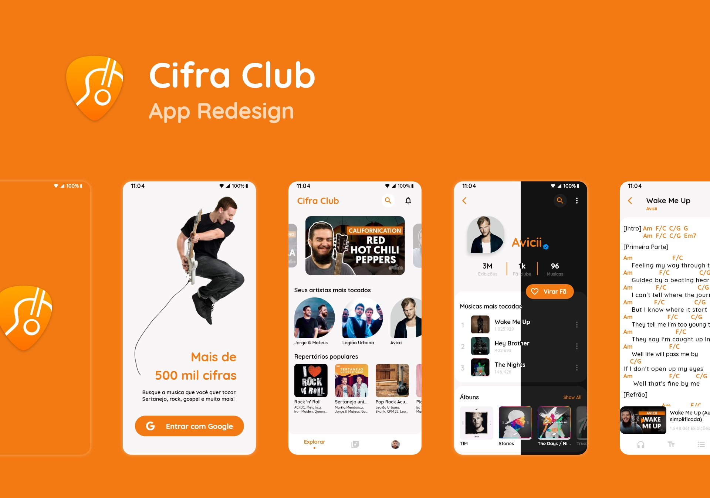

<p align="center">
  
       
  

</p>

# Cifra Club App - Flutter Redesign UI 

This project was developed at Next Level Week, an intense week of studies, networking, friendship, group work, accompanied by a sensational project developed by Rocketseat from the 20th to the 27th of June.
This application is a Billet Management, containing several features, which will soon be developed and explained.

## Features:

=> Splash Page

=> Explore Page

=> Eibary Page

=> Profile Page

=> Settings Page

=> Singer Page

## Libraries & Tools Used

- [flutter_svg](https://pub.dev/packages/flutter_svg)
- [google_fonts](https://pub.dev/packages/flutter_svg)
- [Provider](https://github.com/rrousselGit/provider) (State Management)
- [expandable](https://pub.dev/packages/expandable)

## Folder Structure
Here is the core folder structure which flutter provides.

```
flutter-app/
|- android
|- build
|- ios
|- lib
|- test
```
Here is the folder structure we have been using in this project

```
lib/
|- src/
  |- modules/
  |- shared/
  |- app_widget.dart
|- generated_plugin_registrant.dart
|- main.dart
```
##Photos
